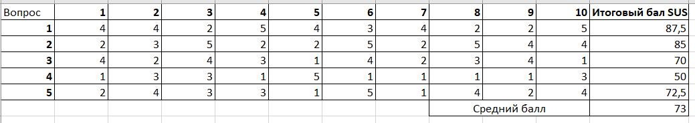

# Организация и проведение юзабилити-тестирования компонента образовательной среды образовательного учреждения.
## Целью тестирования является определение удобства и логики построения сайта.
### Метод: Usability Testing
Сайт для проверки: https://skillbox.ru/

Сайт Skillbox.ru является одним из самых популярных образовательных порталов в России. Он предлагает широкий спектр курсов по различным направлениям, таким как программирование, дизайн, маркетинг и многое другое.

Интерфейс сайта выполнен в современном стиле, преобладают светлые тона. Верхняя часть сайта содержит логотип и основные кнопки навигации. В центре экрана находится каталог курсов, который можно фильтровать по различным параметрам: по цене, по длительности, по уровню сложности и т.д. Справа от каталога курсов находится блок с информацией о текущих акциях и скидках, а также форма поиска. В нижней части сайта расположены контакты и информация о компании.

Преимущества сайта:

- Удобный интерфейс: Сайт имеет простой и понятный интерфейс, который облегчает навигацию и поиск нужных курсов.
- Большой выбор курсов: На сайте представлено более 500 курсов по различным темам.
- Качество обучения: Все курсы разработаны опытными преподавателями и специалистами из разных областей.
- Обратная связь: На сайте есть возможность получить обратную связь от преподавателей и других пользователей.
- Поддержка клиентов: На сайте работает служба поддержки, которая помогает пользователям решать возникающие вопросы и проблемы. Иконка поддержки находится в левом нижнем углу

Недостатки сайта:

- Ограниченный выбор бесплатных курсов: На сайте доступны только несколько бесплатных курсов, в то время как большинство из них требуют оплаты.
- Слишком большие элементы на главной станице: На главной странице размещены большие визуальные блоки, что делает страницу слишком длинной.
- Реклама: На сайте присутствует реклама, которая может отвлекать пользователей от обучения.

В целом, сайт Skillbox.ru представляет собой удобный и функциональный образовательный портал, который может быть полезен как начинающим, так и опытным специалистам в различных областях.

### SUS – System Usability Scale
Что измеряет: SUS – это опросник, призванный оценить общее юзабилити вашего продукта. Он состоит из 10 вопросов, вместе раскрывающих, насколько пользователю удобно пользоваться сайтом/приложением. Зачастую, из-за сложности опроса для респондентов, его проводят только во время юзабилити-тестов.

**Зачем измерять:** это не самый простой для клиента способ рассказать, насколько ему удобно. 10 вопросов осилит далеко не каждый. Но сформулированы они таким образом, чтобы получить максимально объективную картину в разрезе.

**Как измерять:**
Для начала – дать респондентам 10 утверждений, каждое из которых они оценивают по шкале от 1 (совершенно не согласен) до 5 (полностью согласен). Нечётные утверждения – положительные, чётные – отрицательные:

1. Я буду часто использовать этот продукт/функцию/услугу;
2. Продукт/функция/услуга слишком сложный;
3. Продуктом/функцией/услугой легко пользоваться;
4. Мне понадобится помощь, чтобы научиться пользоваться этим продуктом/функцией/услугой;
5. Разные функции в этом продукте/услуге правильно сгруппированы;
6. В продукте/функции/услуге слишком много несоответствий;
7. Большая часть людей очень быстро научится пользоваться этим продуктом/функцией/услугой;
8. Этот продукт/функцию/услугу очень трудно использовать;
9. Я уверенно себя чувствовал(а), используя этот продукт/функцию/услугу;
10. Мне пришлось многому научиться, прежде чем я смог(ла) работать с продуктом/функцией/услугой.

Чтобы рассчитать итоговую оценку, нужно:  
- Для нечётных вопросов: вычесть единицу из их оценки
- Для чётных вопросов: вычесть их оценку из пяти (получаются значения от 0 до 4 по каждому вопросу)
- Сложить все 10 значений
- Умножить сумму на 2,5 (получается значение от 0 до 100)
- Подсчитать среднее арифметическое среди всех SUS-показателей респондентов.

Примерная характеристика для различного количества баллов:
- 80.3 или выше. Люди любят ваш сайт и готовы рекомендовать его своим друзьям.
- 68 или около того. Сайт хорошо оформлен, но можно сделать и лучше.
- 51 или ниже. Сайт нужно как можно быстрее сделать более удобным в использовании.

